<!-- Generated by GitHub Profile Agent Console. Edit profile.config.json, then run npm run generate. -->

  <picture>
    <source media="(max-width: 760px) and (prefers-color-scheme: dark)" srcset="./assets/hero/agent-console-bd1a85fd-mobile-dark.svg">
    <source media="(max-width: 760px)" srcset="./assets/hero/agent-console-bd1a85fd-mobile-light.svg">
    <source media="(prefers-color-scheme: dark)" srcset="./assets/hero/agent-console-bd1a85fd-dark.svg">
    <source media="(prefers-color-scheme: light)" srcset="./assets/hero/agent-console-bd1a85fd-light.svg">
    
  </picture>

  

## About Me

Computer Science student at Shiv Nadar University with a strong interest in data engineering, AI/ML, and cloud infrastructure.

My work combines technical exploration with a builder mindset: understand the problem, test the system, and share what actually works.

## Current Focus

| Area | What I am exploring |
| --- | --- |
| **AI Agents** | Autonomous workflows |
| **Applied AI** | Turning model capabilities into useful and testable software systems. |
| **Developer Tools** | Better workflows for building, testing, and operating modern software. |

## Featured Work

| Project | Focus | Why it matters |
| --- | --- | --- |
| [**Calibrate**](https://github.com/saketh9549/Calibrate) | Resume Analyser | Your resume doesn't have one score — it has a different one for every job. Calibrate uses AI to score it against a specific JD, and tells you exactly why. |
| [**Project Two**](https://github.com/saketh9549/project-two) | Secondary project focus | A second project that supports the professional direction of this profile. |

## Research Direction

I am interested in systems that can observe state, use tools, evaluate outcomes, and take bounded actions with clear evidence and human oversight.

## Tech Stack

`Python` · `FastAPI` · `React` · `Tailwind CSS` · `AWS` · `MySQL` · `MongoDB` · `Docker` · `Git` · `GitHub`

## Recent Activity

<!-- AUTO:ACTIVITY:START -->
- Aug 11, 2026: pushed 1 commit to [narayaneeyamak/narayaneeyam_app](https://github.com/narayaneeyamak/narayaneeyam_app).
- Aug 10, 2026: pushed 1 commit to [narayaneeyamak/narayaneeyam_app](https://github.com/narayaneeyamak/narayaneeyam_app).
- Aug 4, 2026: pushed 1 commit to [narayaneeyamak/narayaneeyam_app](https://github.com/narayaneeyamak/narayaneeyam_app).
<!-- AUTO:ACTIVITY:END -->

---

  Learning, building, and turning ideas into impactful software.

